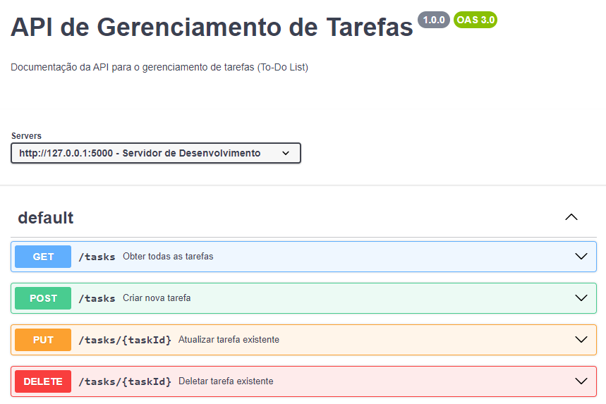

# Tasks Flask CRUD

Um mini projeto para praticar a implementação das operações básicas no desenvolvimento de uma aplicação: Create, Read, Update e Delete.

## Principais recursos utilizados
- Python
- Flask
- Postman

## Documentação
Você pode ver as especificações do projeto copiando o conteúdo do arquivo [\<yaml\>](1705517447273-attachment.x-yaml) e colando no [swagger editor](https://editor.swagger.io/).

## Testes
Você pode rodar o projeto localmente com o comando `python app.py`

Para realizar as requisições, importe o conteúdo do arquivo [\<yaml\>](1705517447273-attachment.x-yaml)  no [Postman](https://www.postman.com/downloads/).